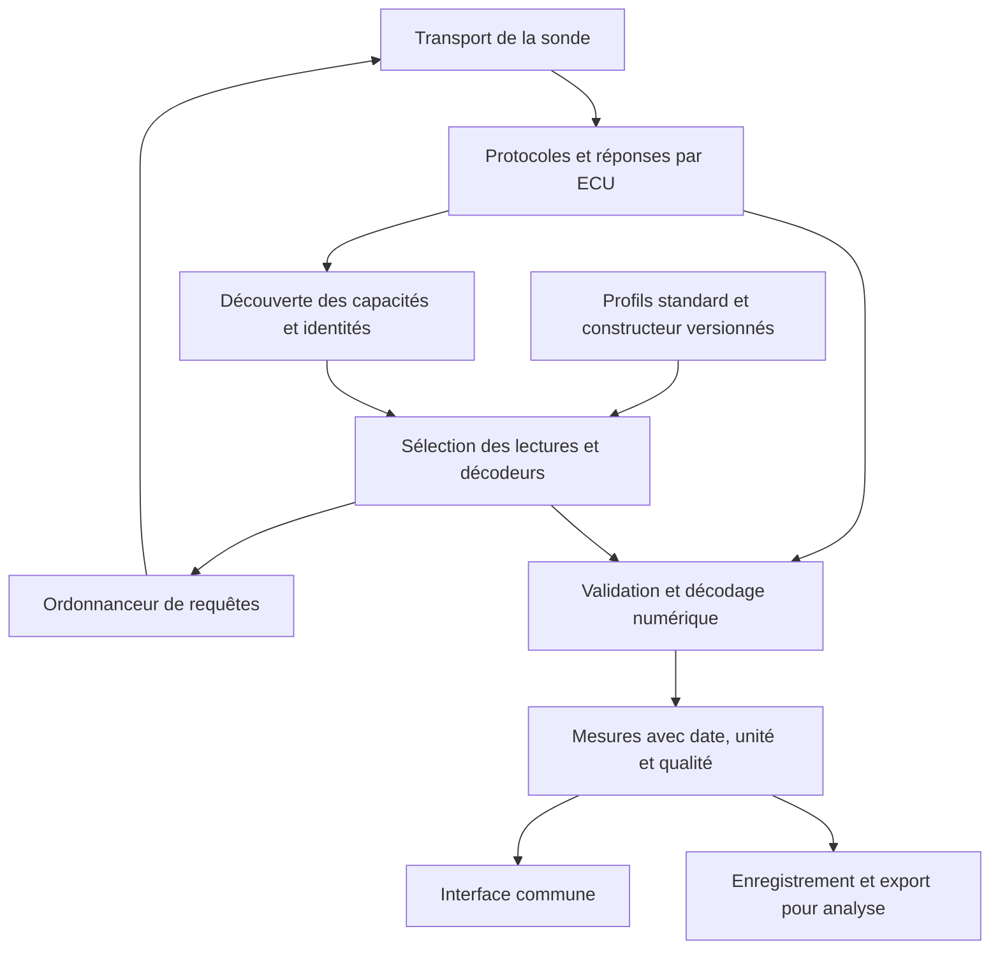

# OBD2 Dash — architecture multimarque

Date : **10 septembre 2026, 20:17 — Europe/Paris (UTC+02:00)**.

Statut : **proposition non retenue, conservée pour mémoire**. Étude fondée sur le dépôt `68590ed` et les sources citées. Aucun changement de code applicatif, aucune installation ni communication avec un véhicule dans cette passe.

## Décision de périmètre — 10 septembre 2026, 20:50

Le projet est personnel et concerne **deux véhicules**. La découverte et la lecture des PID SAE standard existantes restent le socle commun. Le moteur de profils, l'import OBDb/ODX et le langage déclaratif de décodage proposés ci-dessous ne sont pas engagés et ne constituent pas des prérequis aux corrections de l'application ou à l'enregistrement des trajets.

Les travaux utiles restent les corrections de défauts confirmés et la validation de l'acquisition et des exports sur les deux véhicules. Une abstraction supplémentaire ne sera à réexaminer qu'en présence d'un besoin concret et récurrent ; elle n'entre pas dans la feuille de route actuelle.

Pour le FAP du calculateur testé, aucune définition complète et validée (DID, décodage, unités et compatibilité logicielle) n'a été identifiée dans les recherches documentées. Construire un moteur de profils ne fournit pas cette information manquante. Cela ne prouve pas qu'aucune définition publique n'existe ; cela signifie que cette proposition ne résout pas le blocage observé.

**La suite du document conserve l'étude initiale. Ses objectifs, composants et étapes sont des propositions écartées, pas des travaux à lancer.**

## Objectif étudié (non retenu)

Une même application doit découvrir les capacités accessibles, lire les données standard, compléter les mesures avec les profils constructeur compatibles, puis enregistrer un trajet exploitable sur PC. Ajouter un véhicule couvert par un protocole déjà implémenté doit se faire par ajout de définitions, sans nouvelle branche de code propre à sa marque.

La solution est un **moteur commun piloté par une base de profils multimarques**, avec sélection automatique quand les informations disponibles suffisent. Le profil décrit les particularités du calculateur ; l'application et son interface restent communes. Un véhicule de développement sert de cas de test, sans déterminer les règles générales.

Il faut distinguer trois conditions de couverture : l'interface matérielle peut communiquer avec le véhicule ; le protocole est implémenté ; les signaux ont une définition fiable. Une application ne peut pas garantir tous les paramètres de tout véhicule avec une seule sonde ELM327. Un véhicule sans interface exploitable, un transport incompatible ou une définition constructeur absente impose une limite réelle. Le produit doit l'indiquer précisément et continuer les lectures qui restent disponibles.

## Fonctionnement à la connexion

1. Ouvrir le transport de la sonde et déterminer ses capacités utiles. Conserver explicitement un protocole inconnu ; ne pas choisir arbitrairement un décodeur CAN.
2. Amorcer le diagnostic selon les protocoles pris en charge, identifier les répondants et créer un contexte distinct par ECU. Une absence de réponse mode01 ne suffit pas à exclure toutes les autres familles de diagnostic.
3. Découvrir séparément les capacités des modes/services standard. Lire leur contexte : état moteur, échelles annoncées, présence des capteurs, banques et variantes. Les listes mode01, mode02, mode06 et mode09 ne sont pas interchangeables.
4. Recueillir les identités disponibles : VIN, marque/modèle/année lorsqu'ils peuvent être établis, références ECU, versions logiciel et jeu de données. Le VIN seul ne garantit pas le choix d'un décodeur constructeur ; l'identité peut être partielle ou indisponible.
5. Charger les profils locaux correspondants. Séparer correspondance validée, correspondance candidate et absence de profil. Une incompatibilité de version interdit d'appliquer silencieusement le profil voisin. Une sélection manuelle du véhicule peut aider à identifier un candidat ; elle ne prouve pas sa compatibilité technique.
6. Construire la liste des lectures autorisées et réalisables avec cet adaptateur. Vérifier les réponses, puis publier des mesures numériques normalisées pour l'interface et l'enregistreur.

Les profils installés restent utilisables hors ligne pendant le trajet. Les mises à jour de profils se font entre les sessions ; chaque capture garde la version effectivement utilisée. Un nouveau profil ne doit pas modifier le décodage d'un trajet déjà enregistré sans créer une nouvelle analyse traçable.

## Base de définitions réutilisable

**Première source proposée : [OBDb](https://github.com/OBDb).** Cette organisation publie des profils de véhicules en JSON. Le [format utilisé par Pelican](https://pelican.clutch.engineering/scanning/extended-pids/) décrit les adresses émission/réception, les services et identifiants, l'extraction des bits, le signe, l'ordre des octets, les facteurs de conversion, les unités et des conditions d'applicabilité. Cela permet de démarrer une bibliothèque multimarque avec des données existantes.

La présence d'un modèle dans cette base ne prouve pas la couverture de toutes ses motorisations et versions ECU. Notre importateur doit conserver les contraintes publiées et signaler celles qui manquent. Le [profil Ford F-150](https://github.com/OBDb/Ford-F-150/blob/main/signalsets/v3/default.json) illustre la structure ; ses [captures de tests](https://github.com/OBDb/Ford-F-150/tree/main/tests/test_cases) peuvent servir à vérifier les décodeurs hors véhicule. Ce sont des exemples de format, pas de nouvelles commandes autorisées sur un véhicule connecté.

La [licence de ce dépôt de données](https://raw.githubusercontent.com/OBDb/Ford-F-150/main/LICENSE) est CC-BY-SA-4.0. L'import doit conserver origine, attribution, licence, révision et transformations appliquées. Vérifier la licence de chaque source ; celle d'un frontal web ne détermine pas celle des données. Aucune donnée tierce n'est copiée dans l'application par cette proposition.

**Deuxième voie : importer des définitions ODX/PDX disponibles avec des droits d'utilisation adaptés.** Le standard [ASAM MCD-2 D, dit ODX](https://www.asam.net/standards/detail/mcd-2-d/), décrit les échanges diagnostiques et leur décodage indépendamment du fournisseur, du bus et du protocole. C'est un format pour configurer un moteur commun. Il ne constitue pas une base publique complète des définitions de tous les constructeurs ; lire un nom ODX depuis l'ECU ne télécharge pas son contenu.

Les profils vérifiés localement et les autres sources documentées entrent par le même format interne. Leur provenance et leur niveau de preuve restent visibles. Une base communautaire, un import ODX et un profil issu d'une capture ne doivent pas recevoir automatiquement le même statut de validation.

## Format interne des profils

Le format est déclaratif. Il ne contient pas de code Kotlin/Python/JavaScript à exécuter ni de script AT arbitraire. Les opérations de décodage sont limitées et validées : extraction, signe, ordre des octets, calcul rationnel, table d'énumération et dépendance explicite à une échelle de contexte.

| Partie | Informations nécessaires |
|---|---|
| Identité du profil | Identifiant stable, version, source, révision source, licence, attribution |
| Applicabilité | Famille de diagnostic, véhicule/années si connus, ECU, contraintes matériel/logiciel/jeu de données et inconnues restantes |
| Requête | Service, identifiant, adresse cible et répondants admis, format de transport |
| Préconditions | Capacité annoncée, contexte nécessaire, conditions véhicule et session documentées |
| Réponse | Service positif attendu, écho PID/DID, longueurs, séquence, états négatifs |
| Signal | Nom sémantique stable, libellé, unité, extraction, formule, valeurs sentinelles, méthode de mesure/estimation |
| Acquisition | Période cible, priorité, budget de temps, expiration, règle de reprise après indisponibilité |
| Validation | Documentation, captures disponibles, cas de rejeu, identités testées sur véhicule, limites connues |

L'importateur OBDb traduit son schéma vers ce modèle, sans exécuter les requêtes. Deux points de format demandent une attention particulière : `freq` est documenté en **secondes** ; `diagnosticLevel`, `din` et `dout` peuvent impliquer des changements de session. Ils doivent être détectés et évalués séparément du périmètre de lectures simples, pas exécutés lors d'un import. [Documentation du format](https://pelican.clutch.engineering/scanning/extended-pids/).

## Protocoles et matériels

Le lien PC/téléphone–sonde, le bus du véhicule et le service diagnostique sont trois couches distinctes. Avoir une sonde Wi-Fi ne renseigne pas sur sa capacité à traiter toutes les variantes CAN ou d'autres transports.

| Couche | Décision proposée |
|---|---|
| Lien vers la sonde | Conserver ELM sur TCP comme premier transport ; une interface commune permettra d'autres liens sans réécrire les décodeurs |
| OBD existant | Organiser les chemins J1850, ISO9141/KWP et CAN11/CAN29 explicitement ; valider les variantes avant de les annoncer compatibles |
| Services standard | Exploiter les services et PID réellement disponibles, y compris les informations FAP standard lorsque le véhicule les annonce |
| Diagnostic constructeur | Charger les définitions compatibles et utiliser le moteur de protocole approprié, avec gestion des ECU et de leurs contextes |
| Évolutions | Prévoir des fournisseurs de services distincts pour OBDonUDS et autres familles ; ne pas étendre implicitement les hypothèses du mode01 historique |
| Transport non pris en charge | Indiquer la limitation matérielle ou logicielle sans tenter de la compenser par une suite de requêtes inconnues |

Le recours à UDS n'implique pas à lui seul des identifiants propriétaires : **OBDonUDS est aussi une famille standardisée**, définie par SAE J1979-2. [Présentation de la norme par SAE](https://saemobilus.sae.org/standards/j1979-2_202104-e-e-diagnostic-test-modes-obdonuds). Les véhicules électriques, poids lourds et anciens véhicules peuvent nécessiter des familles de données ou interfaces supplémentaires ; ils ne deviennent pas couverts par simple ajout de PID au catalogue actuel.

## Mesures communes et enregistrement

Chaque lecture produit une valeur numérique ou une énumération, avec `sessionId`, identité du véhicule, ECU, service/PID/DID, octets bruts, dates de requête/réponse, temps monotone, unité, qualité, version de profil et contexte de décodage. Le texte localisé est créé au moment de l'affichage ; il ne constitue pas la donnée de référence pour l'analyse.

L'enregistreur consomme les nouvelles mesures validées. Il n'envoie aucune requête supplémentaire. Un export périodique en tableau peut être dérivé de ce flux, mais doit garder la date réelle de chaque mesure et distinguer une valeur répétée d'une nouvelle lecture. La date de consultation d'un freeze frame n'est pas celle de l'événement historique.

Les noms sémantiques permettent une interface commune sans mélanger des données différentes : pression admission absolue et relative ; pression rail réelle et consigne ; EGR commandée et position réelle ; suie calculée et autre estimation rapportée par l'ECU ; masse et volume de cendres. Les conversions d'unités ne doivent pas effacer ces distinctions.

Pour la régénération FAP, afficher un état directement lu quand il est documenté. Une détection calculée à partir de températures ou d'autres signaux garde le statut **estimation**, avec méthode et limites. Une donnée FAP indisponible n'est pas un filtre sain ou vide. Un véhicule sans FAP identifié ne reçoit pas des jauges FAP artificielles.

L'analyse IA reçoit les valeurs, la provenance et les données manquantes. Elle peut chercher des tendances et des écarts reproductibles. Elle ne doit pas attribuer un sens certain à des octets inconnus ni transformer une corrélation en ordre de modification des réglages ECU.

## Acquisition compatible avec les trajets

Une seule file contrôle la sonde et ses changements de configuration. Les opérations comprenant plusieurs requêtes liées sont exclusives ; le verrou d'une commande isolée ne suffit pas à protéger une transaction complète. La file conserve la session et l'ECU associés à chaque réponse, y compris après une annulation.

La fréquence dépend du temps réellement consommé par les requêtes. Les valeurs dynamiques sélectionnées sont prioritaires, les températures peuvent être interrogées moins souvent, les identités/échelles sont lues au démarrage. « Tous les paramètres » peut signifier un inventaire large ; cela ne garantit pas leur acquisition simultanée à fréquence élevée sur une liaison séquentielle.

Les demandes sont construites à partir de définitions vérifiées. Les écritures, effacements, actionneurs et régénérations forcées restent exclus. Un profil demandant une session étendue n'est pas assimilé automatiquement à une simple lecture. Le sondage d'identifiants inconnus n'est pas le mécanisme de découverte normal et ne s'exécute pas en circulation.

## Changements concrets dans le dépôt

| Élément actuel | Évolution à implémenter |
|---|---|
| `Elm327Client.kt` | Séparer transport ELM, protocole exact, adressage, transactions et interprétation des services ; remplacer le booléen CAN comme représentation centrale |
| `CanHeaderReassembly.kt` | Intégrer le regroupement par ECU après validation du format choisi, des longueurs et séquences ; ajouter un chemin CAN29 testé, conserver les formats non CAN distincts |
| `PidCatalog.kt` | Faire évoluer `decode → String` vers un décodeur de valeurs typées ; déplacer les échelles mutables globales dans un contexte immuable par session/ECU |
| Nouveau module de profils | Charger, valider, normaliser et sélectionner les définitions standard et constructeur, avec un import OBDb versionné |
| `ObdViewModel.kt` | Déléguer découverte et planification à un moteur indépendant de l'UI ; ne pas confondre état affiché, stockage des mesures et définition du véhicule |
| Enregistreur CSV | Conserver valeur brute/numérique, unité, horodatage réel, ECU, qualité et version du décodeur ; proposer une vue tabulaire lisible en complément |
| `DtcHistoryStore.kt` | Préserver l'isolation des véhicules, y compris lorsque le VIN manque ; enregistrer service et ECU pour les codes constructeur |
| Interface | Afficher les mesures accessibles avec une explication courte des données indisponibles ; mêmes écrans sur toutes les marques |

Les nouveaux composants suggérés sont `VehicleSession`, `EcuContext`, `DiagnosticProtocol`, `ProfileRepository`, `ProfileMatcher`, `ReadScheduler` et `Measurement`. Ce sont des responsabilités proposées, pas des classes déjà créées.

## Ordre de réalisation et critères de validation

1. **Moteur commun et données typées.** Conserver les fonctions existantes, isoler les contextes par ECU, traiter correctement protocole inconnu, annulation et erreurs. Vérifier que deux véhicules successifs n'échangent ni valeurs ni échelles.
2. **Couverture standard et enregistrement fiable.** Découvrir les capacités par service, suivre les banques, conserver les données de contexte et exporter les mesures réellement acquises. Vérifier les trames tronquées, réponses multiples, changements d'horloge et différence entre mesures actuelles et historiques.
3. **Import de profils multimarques.** Importer un petit ensemble documenté provenant de plusieurs constructeurs ; rejouer leurs captures hors véhicule. Vérifier unités, signe, endianness, critères de sélection et refus d'un profil incompatible ou incomplet. Aucun nombre de profils importés ne vaut certification sur route.
4. **Validation progressive des transports et véhicules.** Tenir une matrice séparant « documenté », « rejoué sur capture » et « vérifié sur véhicule » pour chaque famille de service, variante de transport et groupe de signaux.

La première livraison doit permettre une acquisition standard fiable avec le même code sur les variantes effectivement validées. Les profils apportent ensuite la profondeur constructeur sans multiplier les implémentations par marque. L'obtention des définitions manquantes reste un travail de couverture de la base ; elle ne peut pas être remplacée par une promesse de détection automatique universelle.
